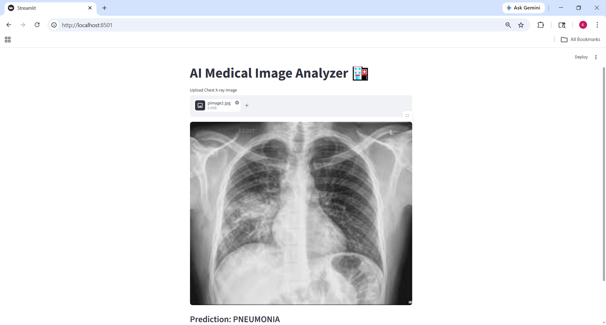
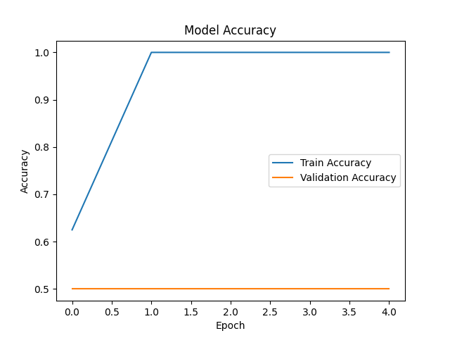
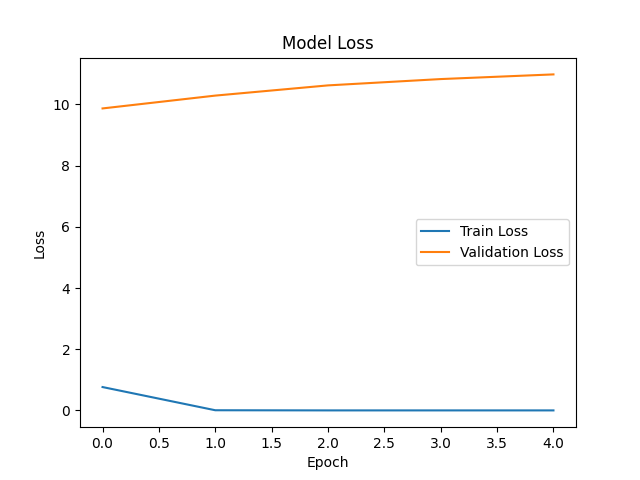

# 🏥 AI-Powered Medical Image Analysis System

## 📌 Overview
This project is a deep learning-based system that analyzes chest X-ray images to detect pneumonia.

## 🎯 Problem Statement
Manual diagnosis of medical images is time-consuming and prone to human error. This system assists in faster and more accurate detection.

## 🚀 Features
- Pneumonia detection using AI
- Image preprocessing using OpenCV
- Deep learning model (MobileNetV2)
- Accuracy & loss visualization
- Confusion matrix evaluation
- Streamlit web application for real-time prediction

## 🧠 Tech Stack
- Python
- TensorFlow / Keras
- OpenCV
- NumPy
- Matplotlib
- Streamlit

## 📂 Project Structure
```
AI-Medical-Image-Analysis/
│
├── data/
├── models/
├── outputs/
├── src/
├── app.py
├── main.py
├── requirements.txt
```

## ⚙️ Installation
```bash
pip install -r requirements.txt
```

## ▶️ Run Project

### Train Model
```bash
python src/train.py
```

### Run Prediction
```bash
python main.py
```

### Run Web App
```bash
python -m streamlit run app.py
```

## 📊 Results
- Accuracy Graph
- Loss Graph
- Model Predictions

## 📸 Screenshots
### Web App


### Accuracy Graph


### Loss Graph


## ⚠️ Note
Model file is excluded due to GitHub size limits. You can retrain the model using the dataset.

## 👨‍💻 Author
Bujja Karthik
